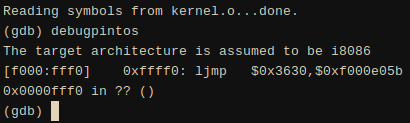

# The Bootloader

## Glossary

### Real [address] Mode

<div style="text-align: center;">
[Real Mode Asm](https://wiki.osdev.org/Real_mode_assembly_I)
</div>

Real mode is a special operating mode for x86 compatible CPU's in which
addresses correspond to real locations, basically allowing for physical
addressing.

## Special Subroutines Index

### no\_such\_drive, no\_boot\_partition

```asm
no_such_drive:
no_boot_partition:
	# Didn't find a Pintos kernel partition anywhere, give up.
	call puts
	.string "\rNot found\r"

	# Notify BIOS that boot failed.  See [IntrList].
	int $0x18
```

In IBM PCs, the `INT 18h` interrupt would trigger an interpret of BASIC stored
in some Option ROMs, usually called when there were not bootable disk volumes on
startup.

As time went on and BASIC was no longer shipped on all PCs, this interrupt would
simply display an error message indicating that no bootable volume was found
(such as "No ROM BASIC", or more explanatory messages in later BIOS versions);
in other BIOS versions it would prompt the user to insert a bootable volume and
press a key, and then after the user pressed a key it would loop back to the
bootstrap loader (`INT 19h`) to try booting again.

### read\_sector

```asm
#### Sector read subroutine.  Takes a drive number in DL (0x80 = hard
#### disk 0, 0x81 = hard disk 1, ...) and a sector number in EBX, and
#### reads the specified sector into memory at ES:0000.  Returns with
#### carry set on error, clear otherwise.  Preserves all
#### general-purpose registers.

read_sector:
	pusha
	sub %ax, %ax
	push %ax			# LBA sector number [48:63]
	push %ax			# LBA sector number [32:47]
	push %ebx			# LBA sector number [ 0:31]
	push %es			# Buffer segment
	push %ax			# Buffer offset (always 0)
	push $1				# Number of sectors to read
	push $16			# Packet size
	mov $0x42, %ah			# Extended read
	mov %sp, %si			# DS:SI -> packet
	int $0x13			# Error code in CF
	popa				# Pop 16 bytes, preserve flags
popa_ret:
	popa
	ret				# Error code still in CF
```

Primero guardamos en el stack, los valores actuales de los registros con
`pusha`, estos se usarán luego para restablecer los registros con `popa_ret`.

Se "nullifica" cual sea que sea el valor del registro `ax` con `sub %ax, %ax`,
equivalente a `ax -= ax`.

Now, we need some kind of interrupt to read some certain number of sectors from
the drive, for this purpose we must use:

<div style="text-align: center;">
[`INT 13h`](https://en.wikipedia.org/wiki/INT_13H)
</div>

This interrupt tipically provides sector-based hard disk and floppy disk read
and write services using cylinder-head-sector (CHS) addressing. This interrupt
takes `ah` as service parameter, so, for `ah = 0x42`, we got a "Read Sectors
From Drive" extended instruction made for >8GiB Drives.

There is a special "packet" of data called the "DAP" (Disk Address Packet), we
use this "descriptor" block to describe in what way do we want to read data from
a certain Drive. The DAP is divided as follows:

```
offset range    size        description
00h 	        1 byte 	    size of DAP (set this to 10h)

01h 	        1 byte 	    unused, should be zero

02h..03h 	    2 bytes 	number of sectors to be read, (some Phoenix BIOSes are
                            limited to a maximum of 127 sectors)

04h..07h 	    4 bytes 	segment:offset pointer to the memory buffer to which
                            sectors will be transferred (note that x86 is
                            little-endian: if declaring the segment and offset
                            separately, the offset must be declared before the
                            segment)

08h..0Fh 	    8 bytes 	absolute number of the start of the sectors to be read
                            (1st sector of drive has number 0) using logical
                            block addressing (note that the lower half comes
                            before the upper half)[9]
```

The DAP is located at some memory address pointed to by the `DS:SI` pointer, for
this purpose we use `mov %sp, %si`. Once we already stored all the values of the
DAP at the stack, we can use the `sp` register (which always points to the top
of the stack) as the DAP pointer. For this purpose, one would think that we need
to always set the data segment (`DS`) to 0 for the pointer to be an absolute
address; yet, in both 32 and 64bit archs of x86, the `CS`, `SS`, `DS` and `ES`
are initialized in 0.

<div style="text-align: center;">
*Pointers of the form of `segment:offset` are calculated as $16 \times
\text{segment} + \text{offset}$.*
</div>

We still need to save the read data somewhere, that is where the BAP (Buffer
Address Pointer) gets to be used. The `INT 13h` interrupt checks the `ES:BX`
segment pointer for where to store the data at.

Ok, we already read the data and stored it at some memory address but our
registers are scrambled and the stack has 16 "trash" bytes that we allocated for
the DAP. To return the registers to their initial state we often use `popa` (for
simple words) to pop words into the general-purpose registers after having used
`pusha` first.

In our context, we have 2 groups of 16 bytes: The top 16 bytes contain the DAP
values and the bottom ones contain the actual `pusha`'d registers, so we need 2
`popa`s in order to actually get to restore the registers to their normal state.

Once we hace restored the registers we `ret` from the call.

## Loading the Bootloader

Once the BIOS has recognized that there is an available bootable Disk Drive, by
checking for its MBR in removable drives, it loads the first-stage bootloader
code located at the first 512 bytes of the Drive, which are known as the MBR, or
even less, depending on how many bytes inside the MBR are left for some special
BIOS features. The code is loaded at `[0x7c00, 0x7dff]` into memory, then the
BIOS stores a `jmp` to the beginning of that newly loaded sector (where the
bootloader resides) at address `0xFFFFFFF0` (which is the address of the
system's first instruction for x86-based systems).

<div style="text-align: center;">

</div>

## The Stage 1 Bootloader itself

This is what runs when Pintos gets to run:

```sh
root@4c7396e1a5a1:~/pintos/src/threads# pintos --
qemu-system-i386 -device isa-debug-exit -drive format=raw,media=disk,index=0,file=/tmp/8vc2gfAvNP.dsk -m 4 -net
 none -nographic -monitor null

Pintos hda1
Loading...........
Kernel command line:
Pintos booting with 3,968 kB RAM...
367 pages available in kernel pool.
367 pages available in user pool.
Calibrating timer...  157,081,600 loops/s.
Boot complete.
qemu-system-i386: terminating on signal 2
```

The first portion of output is "`Pintos`", this comes from:

```asm
# Runs in real mode, which is a 16-bit segment.
	.code16

# Set up segment registers.
# Set stack to grow downward from 60 kB (after boot, the kernel
# continues to use this stack for its initial thread).

	sub %ax, %ax
	mov %ax, %ds
	mov %ax, %ss
	mov $0xf000, %esp

# Configure serial port so we can report progress without connected VGA.
# See [IntrList] for details.
	sub %dx, %dx			# Serial port 0.
	mov $0xe3, %al			# 9600 bps, N-8-1.
					# AH is already 0 (Initialize Port).
	int $0x14			# Destroys AX.

	call puts
	.string "Pintos"
```

<div style="text-align: center;">
*What's happening?*
</div>

So, first things first: We need to set up the cpu so from now on memory
addressing is done as physical (real) addressing, for this purpose we can use the
16-bit real mode available under our syntax (GAS, GNU Assembler Syntax) to be
set up  as "`.code16`".

Now, we set up the `esp` register (32-bit stack pointer register) to point to
what will be used in the future as our stack (`0xf000` or 60\*1024 bytes or 60
KiB).

Now, we must report our progress to the qemu serial port, to do this, we will
use the interrupt:

<div style="text-align: center;">
[`INT 14h`](https://www.plantation-productions.com/Webster/www.artofasm.com/DOS/ch13/CH13-3.html)
</div>

Which will open a Serial communication port. This interrupt takes both `dx` and
`ax` as parameters:

- `dx` = 0x00: COM1
- `ah` = 0x00: Serial Port Initialization/Configuration
- `al` = 0b11100011:
  - 111: baud rate of 9600
  - 00: no parity bit
  - 0: 1 stop bit
  - 11: character size of 8 bits (`uint8_t`)

It then calls the `puts` function which will take only a pointer (created
immediately after by `.string`) to the data ("`Pintos`").

Now that we have the confirmation for the fact that we just jumped into the
stage 1 bootloader, we can start the actual bootloading process, which should
load the kernel into memory and then `jmp` to its entry point.

```asm
#### Read the partition table on each system hard disk and scan for a
#### partition of type 0x20, which is the type that we use for a
#### Pintos kernel.
####
#### Read [Partitions] for a description of the partition table format
#### that we parse.
####
#### We print out status messages to show the disk and partition being
#### scanned, e.g. hda1234 as we scan four partitions on the first
#### hard disk.

	mov $0x80, %dl			# Hard disk 0.
read_mbr:
	sub %ebx, %ebx			# Sector 0.
	mov $0x2000, %ax		# Use 0x20000 for buffer.
	mov %ax, %es
	call read_sector
	jc no_such_drive

	# Print hd[a-z].
	call puts
	.string " hd"
	mov %dl, %al
	add $'a' - 0x80, %al
	call putc

	# Check for MBR signature--if not present, it's not a
	# partitioned hard disk.
	cmpw $0xaa55, %es:510
	jne next_drive

	mov $446, %si			# Offset of partition table entry 1.
	mov $'1', %al
```

We detailed how the `read_sector` call works previously. We detail the number of
the drive from which we want to boot using the `dl` register.

> for bios functions, hard drives typically have the most significant bit set
> (0x80 == 10000000). So hard drive #0 is referred to as 0x80, #1 is 0x81, etc.
> Floppy drives don't have this bit set and so count from 0.
>
> -[https://stackoverflow.com/a/45900735](https://stackoverflow.com/a/45900735)

The data will be stored according to the `segment:offset` pointer detailed by
`es:bx`. In this case, the data read from the sector will be stored at
`0x2000`.

On error, the `INT 13h` interrupt used to read the sector sets CF so, to handle
errors, we jump to `no_such_drive`.

We want to know which hard drive are we reading sectors from, for this purpose,
we store the `dl` resgister back on the `al` one, so we print `hd{n}` where $n =
[a, z]$. If we were reading from, say, 0x82, instead of 0x80, we would print
"hdc" since `0x82-0x80=0x2` and `'a' + 2 = 'c'`.

This is part of the structure of a typical generic MBR:

```
offset          description (value)         size
0x01FE (510) 	0x55 	Boot signature[a] 	2
0x01FF (511) 	0xAA
```

((( I think this is due to x86's little-endianness )))

The signature is a word contained at offset `0x01fe`. Since x86 is
little-endian, the actual value should look like `0xaa55`, hence the "compare
word" instruction (`cmpw`).

If the drive has no valid signature, we can jump to the next drive:

```asm
next_drive:
	# No match on this drive, go on to the next one.
	inc %dl
	jnc read_mbr
```

In case we run out of possible drives (`CF` is set due to an overflow), we just
fall back to `no_such_drive`.

Ok, so we are in a valid drive already, now it's time to check for valid
partitions:

```asm
	mov $446, %si			# Offset of partition table entry 1.
	mov $'1', %al
check_partition:
	# Is it an unused partition?
	cmpl $0, %es:(%si)
	je next_partition

	# Print [1-4].
	call putc

	# Is it a Pintos kernel partition?
	cmpb $0x20, %es:4(%si)
	jne next_partition

	# Is it a bootable partition?
	cmpb $0x80, %es:(%si)
	je load_kernel
```

Inside the MBR, the Bootstrap code area only holds a total of 446, the rest of
the 512 bytes are used for both the partition table and the signature.

We ignore the first 446 bytes by using 446 as the first offset to check for
partition entries in the partition table.

Each 16bit partition table entry looks as follows:

```
Offset (bytes) 	Field length 	Description
0x00            1 byte          Status or physical drive (bit 7 set is for
                                active or bootable, old MBRs only accept 0x80,
                                0x00 means inactive, and 0x01–0x7F stand for
                                invalid)

0x01 		    3 bytes 	    CHS address of first absolute sector in partition. The
                                format is described by three bytes, see the next
                                three rows.
```
>
> [Partition table entries](https://en.wikipedia.org/wiki/Master_boot_record#PTE)

If it's an inactive partition, we can jump to the next one:

```asm
next_partition:
	# No match for this partition, go on to the next one.
	add $16, %si			# Offset to next partition table entry.
	inc %al
	cmp $510, %si
	jb check_partition

next_drive:
	# No match on this drive, go on to the next one.
	inc %dl
	jnc read_mbr
```

If we exceed the 510 bytes assigned for the partition table **and** the
bootstrap code and we still haven't found an active partition entry, then the
disk is invalid and we must jump to the next one.

Once we find an active and bootable Pintos' partition entry, we can proceed to
load the kernel.

```asm
#### We found a kernel.  The kernel's drive is in DL.  The partition
#### table entry for the kernel's partition is at ES:SI.  Our job now
#### is to read the kernel from disk and jump to its start address.

load_kernel:
	call puts
	.string "\rLoading"

	# Figure out number of sectors to read.  A Pintos kernel is
	# just an ELF format object, which doesn't have an
	# easy-to-read field to identify its own size (see [ELF1]).
	# But we limit Pintos kernels to 512 kB for other reasons, so
	# it's easy enough to just read the entire contents of the
	# partition or 512 kB from disk, whichever is smaller.
	mov %es:12(%si), %ecx		# EBP = number of sectors
	cmp $1024, %ecx			# Cap size at 512 kB
	jbe 1f
	mov $1024, %cx

1:
	mov %es:8(%si), %ebx		# EBX = first sector
	mov $0x2000, %ax		# Start load address: 0x20000

next_sector:
	# Read one sector into memory.
	mov %ax, %es			# ES:0000 -> load address
	call read_sector
	jc read_failed

	# Print '.' as progress indicator once every 16 sectors == 8 kB.
	test $15, %bl
	jnz 1f
	call puts
	.string "."
1:

	# Advance memory pointer and disk sector.
	add $0x20, %ax
	inc %bx
	loop next_sector

	call puts
	.string "\r"

#### Transfer control to the kernel that we loaded.  We read the start
#### address out of the ELF header (see [ELF1]) and convert it from a
#### 32-bit linear address into a 16:16 segment:offset address for
#### real mode, then jump to the converted address.  The 80x86 doesn't
#### have an instruction to jump to an absolute segment:offset kept in
#### registers, so in fact we store the address in a temporary memory
#### location, then jump indirectly through that location.  To save 4
#### bytes in the loader, we reuse 4 bytes of the loader's code for
#### this temporary pointer.

	mov $0x2000, %ax
	mov %ax, %es
	mov %es:0x18, %dx
	mov %dx, start
	movw $0x2000, start + 2
	ljmp *start

read_failed:
start:
	# Disk sector read failed.
	call puts
1:	.string "\rBad read\r"

	# Notify BIOS that boot failed.  See [IntrList].
	int $0x18
```

Now, we have 2 important registers:

- `es`: pointer to the segment which contains the partition entry
- `dl`: drive number for susequent `read_sector` calls

What we want to do is load all possible sectors from the drive into memory and
then set the global entry point to point to the kernel's.

Currently, this is what the partition entry looks like:

```
Offset (bytes) 	Field length 	Description
0x00            1 byte          Status or physical drive (bit 7 set is for
                                active or bootable, old MBRs only accept 0x80,
                                0x00 means inactive, and 0x01–0x7F stand for
                                invalid)

0x01 		    3 bytes 	    CHS address of first absolute sector in partition. The
                                format is described by three bytes, see the next
                                three rows.
.
.
.

0x08 		    4 bytes 	    LBA of first absolute sector in the partition[f]

0x0C 		    4 bytes 	    Number of sectors in partition[g] 
```

What we want to do now is load the total number of reads we will perform,
considering that each `read_sector` call will read only 1 sector at a time.

The whole Pintos kernel is designed to not go beyond 512kb, so we can cap the
total number of reads to exactly 1024 if they ever go beyond the limit (each
sector is 512 bytes long).

```asm
	mov %es:12(%si), %ecx		# EBP = number of sectors
	cmp $1024, %ecx			# Cap size at 512 kB
	jbe 1f
	mov $1024, %cx

1:
	mov %es:8(%si), %ebx		# EBX = first sector
	mov $0x2000, %ax		# Start load address: 0x20000
```

Now, we have a new tuple of important registers:

- `ebx`: pointer to the sector number to be read
- `ax`: pointer to the segment where the sector will be loaded at
- `{e}cx`: number of sectors to be read in total (capped at 1024)

Each time we read a new sector, we have to:

- increment `ebx` by 1 to read the next in line sector
- increment `ax` by 512 bytes or 32 words to put the next sector in a contiguous
  memory space

To do this, we will loop over `next_sector` (which should use the sectors number
in `ecx` as loop index).

```asm
next_sector:
	# Read one sector into memory.
	mov %ax, %es			# ES:0000 -> load address
	call read_sector
	jc read_failed

	# Print '.' as progress indicator once every 16 sectors == 8 kB.
	test $15, %bl
	jnz 1f
	call puts
	.string "."
1:

	# Advance memory pointer and disk sector.
	add $0x20, %ax
	inc %bx
	loop next_sector

	call puts
	.string "\r"
```

Once we finished loading the whole kernel into memory (starting at address
`0x2000`) We can run the entry point.

```asm
#### Transfer control to the kernel that we loaded.  We read the start
#### address out of the ELF header (see [ELF1]) and convert it from a
#### 32-bit linear address into a 16:16 segment:offset address for
#### real mode, then jump to the converted address.  The 80x86 doesn't
#### have an instruction to jump to an absolute segment:offset kept in
#### registers, so in fact we store the address in a temporary memory
#### location, then jump indirectly through that location.  To save 4
#### bytes in the loader, we reuse 4 bytes of the loader's code for
#### this temporary pointer.

	mov $0x2000, %ax
	mov %ax, %es
	mov %es:0x18, %dx
	mov %dx, start
	movw $0x2000, start + 2
	ljmp *start
```

The last step is to actually set the ELF's header's pointer to the start of the
kernel header table up correctly and then jump to the kernel's entry point.

First, we make it so `%es` points to the origin of the first sector of the
memory space where we loaded the kernel to (`0x2000`). We do this so we can use
this and an additional offset to load and use the ELF header's metadata.

Finally, we load the address of the entry point into the start label and set the
header table address of the ELF format.

Finally, we jump into the kernel's entry point.


